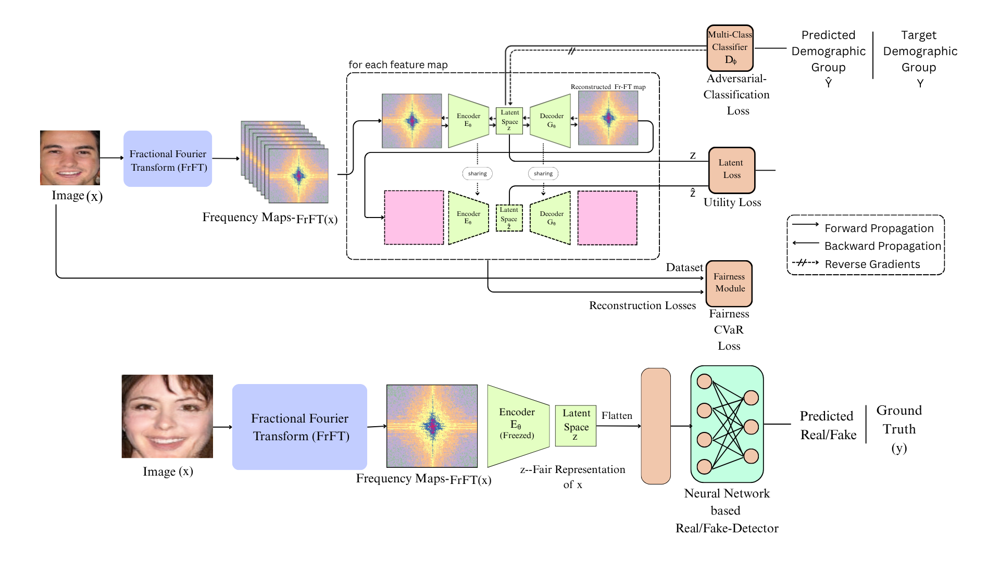

# Fairness in AI: Representation Learning Approaches

## Overview

The past decade has witnessed an unprecedented expansion of artificial intelligence from narrowly scoped research prototypes into production systems that inform—and in many cases determine—outcomes in domains such as medical diagnosis, credit allocation, recruitment, and criminal sentencing.

This rapid growth has introduced challenges that extend beyond traditional technical performance metrics. In particular, AI systems risk reproducing, amplifying, or systematically worsening pre-existing social inequities. Among key dimensions of AI ethics—transparency, accountability, privacy, and safety—**fairness** occupies a central position due to its measurable nature and its disproportionate impact on marginalized populations.

---

## Problem Statement

This project investigates fairness in AI with a focus on **demographic bias in machine learning pipelines**.

Bias is rarely the result of explicit design choices. Instead, it emerges at multiple stages:

* Historical bias embedded in training data
* Underrepresentation of minority groups in datasets
* Subjective decisions during feature engineering and labeling

Once encoded into model parameters, such bias is difficult to detect using standard evaluation metrics. Aggregate accuracy often masks **disparate error rates across demographic subgroups**, making fairness violations non-obvious.

---

## Approach

This work explores **fairness-aware machine learning**, with a particular emphasis on **representation learning**.

### Representation Learning

Representation learning focuses on extracting structured and compact feature encodings from raw data. This report highlights:

* **Disentangled Representation Learning**

  * Separates latent factors corresponding to different attributes
  * Enables isolation of protected demographic information

* **Fairness Objective**

  * Prevent sensitive attributes from influencing downstream predictions
  * Maintain predictive performance while improving equity

---

## Core Methods

### 1. Variational Autoencoders (VAEs)

* Provide a probabilistic framework for learning latent representations
* Serve as the foundation for fairness-aware extensions

### 2. FD-VAE (Fairness-aware Disentangling VAE)

* Introduces a **three-way latent space partition**:

  * Target attributes
  * Protected attributes
  * Shared (mutual) attributes
* Explicitly separates sensitive information from predictive features

### 3. Adversarial Debiasing

* Uses a **gradient reversal layer**
* Trains representations such that:

  * A demographic classifier cannot recover protected attributes
* Encourages invariant feature learning

### 4. Conditional Value-at-Risk (CVaR)

* A **distributionally robust optimization objective**
* Focuses on **worst-performing subgroups**
* Improves fairness even without explicit demographic labels

---

## Proposed Pipeline

A task-specific pipeline is designed for **deepfake detection**, integrating:

* Fractional Fourier Transform (FrFT) preprocessing
* Adversarial autoencoding
* Latent consistency regularization
* CVaR-based fairness loss

This pipeline aims to balance **robust detection performance** with **demographic fairness**.

---

## Evaluation Metrics

The system is evaluated using a comprehensive fairness metric suite:

* **Equal Opportunity**
* **Equalized Odds**
* **Equalized Accuracy**
* **False Positive Rate (FPR) Disparity**

These metrics provide a multi-dimensional view of fairness across demographic groups.

---

## Key Insight

The central thesis of this work is:

> Accuracy and fairness are not inherently conflicting objectives.

Through fairness-aware representation learning, it is possible to design AI systems that are:

* Predictively strong
* Demographically equitable
* Socially responsible

---

## Conclusion

This report demonstrates that incorporating fairness into machine learning is both feasible and necessary. By addressing bias at the representation level and adopting robust optimization strategies, AI systems can move toward more equitable and trustworthy real-world deployment.
